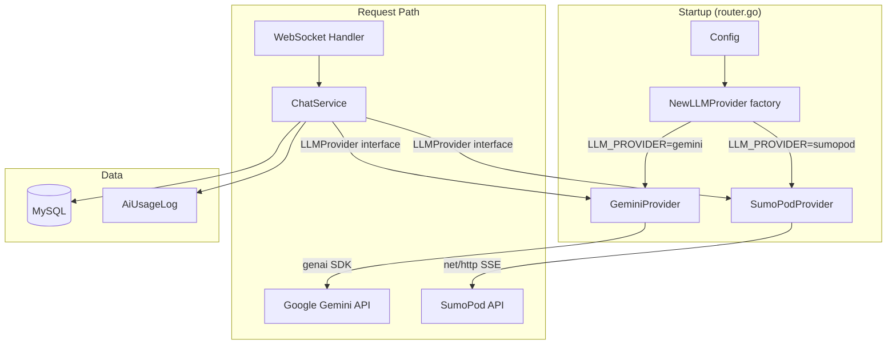

# Design Document: Multi-LLM Provider

## Overview

This design introduces a pluggable LLM provider architecture to the Nadi backend. The current system has `ChatService` directly depending on `GeminiService` — a concrete type. The refactoring introduces an `LLMProvider` interface that both the existing Gemini integration and a new SumoPod OpenAI-compatible provider implement. `ChatService` is updated to depend on the interface, and a `ProviderRegistry` selects the correct implementation at startup based on the `LLM_PROVIDER` environment variable.

No changes are required to `ChatHandler`, the WebSocket protocol, or any frontend code. The migration is fully backward-compatible: if `LLM_PROVIDER` is unset, the system defaults to Gemini.

### Key Design Decisions

- **Interface placement**: The `LLMProvider` interface lives in the `service` package alongside `ChatService`, keeping the dependency graph clean without introducing a new package.
- **Provider implementations**: Each provider is a separate file in the `service` package (`gemini_service.go` refactored, `sumopod_service.go` new), following the existing project convention.
- **Registry as a factory function**: Rather than a registry struct, a single `NewLLMProvider(cfg *config.Config, chatRepo repository.ChatRepository) (LLMProvider, error)` function acts as the factory, keeping the wiring simple.
- **UsageMetadata abstraction**: A new provider-agnostic `UsageMetadata` struct replaces the direct use of `*genai.UsageMetadata` in `ChatService`, decoupling the service from the Gemini SDK.
- **Cost calculation**: Provider-specific cost logic stays in `ChatService` using a switch on the model name prefix, preserving the existing Gemini formula and defaulting to zero cost for unknown providers.

---

## Architecture



The architecture is a straightforward strategy pattern. `ChatService` holds an `LLMProvider` field and calls `GenerateResponseStream` without knowing which concrete provider is behind it. The factory function resolves the provider once at startup and injects it.

---

## Components and Interfaces

### LLMProvider Interface

Defined in `backend/internal/service/llm_provider.go`:

```go
package service

import (
    "context"
    "github.com/hadi-projects/go-react-starter/internal/entity"
)

// UsageMetadata holds provider-agnostic token usage information returned
// after a generation call.
type UsageMetadata struct {
    PromptTokenCount     int32
    CompletionTokenCount int32
    TotalTokenCount      int32
    ModelName            string
}

// LLMProvider is the interface all LLM backends must implement.
// ChatService depends on this interface exclusively.
type LLMProvider interface {
    GenerateResponseStream(
        ctx context.Context,
        mode entity.ChatMode,
        history []entity.ChatMessage,
        userMessage string,
        systemInstructions string,
        onChunk func(string),
    ) (*UsageMetadata, error)
}
```

### ProviderRegistry (Factory Function)

Defined in `backend/internal/service/llm_provider.go` (same file):

```go
// NewLLMProvider selects and instantiates the correct LLMProvider based on
// cfg.SumoPod.LLMProvider. Returns an error if the provider name is
// unrecognized or if the required API key is missing.
func NewLLMProvider(cfg *config.Config, chatRepo repository.ChatRepository) (LLMProvider, error)
```

Supported values for `LLM_PROVIDER`: `"gemini"` (default), `"sumopod"`.

### GeminiProvider

File: `backend/internal/service/gemini_service.go` (refactored)

- Implements `LLMProvider`.
- The existing `GeminiService` interface and `geminiService` struct are replaced by `GeminiProvider` implementing `LLMProvider` directly.
- All existing behavior (system prompt construction, safety settings, RAG context lookup, history conversion, special `[MULAI_CEK_GEJALA]` handling) is preserved unchanged.
- Returns `*UsageMetadata` populated from `genai.UsageMetadata`.

### SumoPodProvider

File: `backend/internal/service/sumopod_service.go` (new)

- Implements `LLMProvider`.
- Sends HTTP POST to `cfg.SumoPod.BaseURL + "/chat/completions"` with `stream: true`.
- Parses the SSE response line-by-line, calling `onChunk` for each `delta.content` fragment.
- Stops on `data: [DONE]`.
- Returns `*UsageMetadata` from the `usage` field of the final SSE chunk (if present).

### ChatService (updated)

File: `backend/internal/service/chat_service.go`

- `chatService` struct field changes from `geminiService GeminiService` to `llmProvider LLMProvider`.
- `NewChatService` constructor parameter changes accordingly.
- `ProcessMessage` calls `s.llmProvider.GenerateResponseStream(...)` instead of `s.geminiService.GenerateResponseStream(...)`.
- Usage logging uses the new `UsageMetadata` struct fields (`PromptTokenCount`, `CompletionTokenCount`, `TotalTokenCount`, `ModelName`).
- Cost calculation uses a helper that switches on `metadata.ModelName` prefix.

### Config (updated)

File: `backend/config/config.go`

New `SumoPodConfig` struct added to `Config`:

```go
type SumoPodConfig struct {
    APIKey      string
    BaseURL     string
    Model       string
    LLMProvider string
}
```

Populated from env vars: `SUMOPOD_API_KEY`, `SUMOPOD_BASE_URL` (default `"https://ai.sumopod.com/v1"`), `SUMOPOD_MODEL` (default `"gpt-4o-mini"`), `LLM_PROVIDER` (default `"gemini"`).

---

## Data Models

### UsageMetadata (new struct, in-memory only)

| Field                | Type   | Description                                      |
|----------------------|--------|--------------------------------------------------|
| PromptTokenCount     | int32  | Tokens in the prompt/input                       |
| CompletionTokenCount | int32  | Tokens in the completion/output                  |
| TotalTokenCount      | int32  | Total tokens consumed                            |
| ModelName            | string | Model identifier (e.g. `"gemini-2.5-flash"`, `"gpt-4o-mini"`) |

This struct is not persisted. It is returned by `GenerateResponseStream` and consumed by `ChatService` to populate `AiUsageLog`.

### AiUsageLog (existing, no schema change)

The `Model` field already stores a string model name. The only change is that `ChatService` now populates it from `UsageMetadata.ModelName` instead of the hardcoded string `"gemini-2.5-flash"`.

### SumoPod HTTP Request Body

```json
{
  "model": "<cfg.SumoPod.Model>",
  "messages": [
    {"role": "system", "content": "<systemInstructions>"},
    {"role": "user",      "content": "<msg>"},
    {"role": "assistant", "content": "<msg>"},
    ...
  ],
  "max_tokens": 8192,
  "temperature": 0.7,
  "stream": true
}
```

### SumoPod SSE Response (per chunk)

```json
data: {"id":"...","object":"chat.completion.chunk","choices":[{"delta":{"content":"fragment"},"finish_reason":null}],"usage":null}
```

Final chunk (may carry usage):
```json
data: {"id":"...","choices":[{"delta":{},"finish_reason":"stop"}],"usage":{"prompt_tokens":100,"completion_tokens":50,"total_tokens":150},"model":"gpt-4o-mini"}
```

Termination sentinel:
```
data: [DONE]
```

---

## Correctness Properties

*A property is a characteristic or behavior that should hold true across all valid executions of a system — essentially, a formal statement about what the system should do. Properties serve as the bridge between human-readable specifications and machine-verifiable correctness guarantees.*

### Property 1: Provider selection is deterministic

*For any* valid `LLM_PROVIDER` value (`"gemini"` or `"sumopod"`), calling `NewLLMProvider` with that value SHALL always return the same concrete provider type and never return both an error and a non-nil provider simultaneously.

**Validates: Requirements 2.2, 3.10, 4.2, 4.3**

### Property 2: Unknown provider always errors

*For any* string that is not `""`, `"gemini"`, or `"sumopod"`, `NewLLMProvider` SHALL return a non-nil error and a nil provider.

**Validates: Requirements 4.5**

### Property 3: Missing API key always errors at startup

*For any* provider selection where the corresponding API key environment variable is empty, `NewLLMProvider` SHALL return a non-nil error.

**Validates: Requirements 2.5, 3.8**

### Property 4: SumoPod message history conversion preserves roles

*For any* slice of `entity.ChatMessage` values with roles `"user"` or `"assistant"`, converting to the OpenAI messages array SHALL produce a slice of the same length where each element's `role` field equals the original message's `role` field, and the `content` field equals the original message's `content` field.

**Validates: Requirements 3.6**

### Property 5: UsageMetadata nil safety in ChatService

*For any* call to `ProcessMessage` where the provider returns a nil `*UsageMetadata`, `ChatService` SHALL complete successfully (no error returned) and SHALL NOT attempt to create an `AiUsageLog` record.

**Validates: Requirements 5.3**

### Property 6: Usage log model name matches provider metadata

*For any* call to `ProcessMessage` where the provider returns a non-nil `*UsageMetadata`, the `Model` field of the created `AiUsageLog` record SHALL equal `UsageMetadata.ModelName`.

**Validates: Requirements 5.2**

### Property 7: Default provider is Gemini

*For any* config where `LLM_PROVIDER` is the empty string, `NewLLMProvider` SHALL return a `GeminiProvider` instance (not an error, not a SumoPodProvider).

**Validates: Requirements 4.4, 6.1**

---

## Error Handling

| Scenario | Component | Behavior |
|---|---|---|
| `LLM_PROVIDER` is unrecognized | `NewLLMProvider` | Returns `fmt.Errorf("unsupported LLM provider %q; supported: gemini, sumopod")` |
| `GEMINI_API_KEY` is empty and provider is `"gemini"` | `NewLLMProvider` | Returns `fmt.Errorf("GEMINI_API_KEY is required for the gemini provider")` |
| `SUMOPOD_API_KEY` is empty and provider is `"sumopod"` | `NewLLMProvider` | Returns `fmt.Errorf("SUMOPOD_API_KEY is required for the sumopod provider")` |
| SumoPod HTTP response status != 200 | `SumoPodProvider` | Returns `fmt.Errorf("sumopod API error: status %d, body: %s", statusCode, body)` |
| SumoPod SSE line is malformed JSON | `SumoPodProvider` | Skips the line and continues (non-fatal) |
| Gemini API returns an error mid-stream | `GeminiProvider` | Propagates the error from `iter.Next()` as-is (existing behavior) |
| `NewLLMProvider` returns an error | `router.go` | Application panics at startup (consistent with existing `validateConfig` behavior) |

The router wires the provider at startup. If `NewLLMProvider` returns an error, the application should fail fast rather than start in a broken state. The router will call `NewLLMProvider` and panic (or `log.Fatal`) on error, consistent with how the existing `validateConfig` panics on missing required fields.

---

## Testing Strategy

### Unit Tests

Focus on specific examples and edge cases:

- `TestNewLLMProvider_Gemini`: verify `"gemini"` returns a `*geminiProvider`.
- `TestNewLLMProvider_SumoPod`: verify `"sumopod"` returns a `*sumoPodProvider`.
- `TestNewLLMProvider_Default`: verify empty string returns a `*geminiProvider`.
- `TestNewLLMProvider_Unknown`: verify unrecognized value returns an error.
- `TestNewLLMProvider_MissingGeminiKey`: verify error when `GEMINI_API_KEY` is empty.
- `TestNewLLMProvider_MissingSumoPodKey`: verify error when `SUMOPOD_API_KEY` is empty.
- `TestSumoPodConvertMessages`: verify role and content mapping for a concrete history slice.
- `TestChatService_ProcessMessage_NilUsage`: verify no `AiUsageLog` is created when provider returns nil metadata.
- `TestChatService_ProcessMessage_UsageLogged`: verify `AiUsageLog.Model` matches `UsageMetadata.ModelName`.

### Property-Based Tests

Using [`pgregory.net/rapid`](https://github.com/flyingmutant/rapid) (pure Go, no external dependencies, suitable for this project's style):

Each property test runs a minimum of 100 iterations.

**Property 1 — Provider selection is deterministic**
Tag: `Feature: multi-llm-provider, Property 1: provider selection is deterministic`
Generate random valid provider strings (`"gemini"`, `"sumopod"`); assert the returned provider is non-nil and error is nil.

**Property 2 — Unknown provider always errors**
Tag: `Feature: multi-llm-provider, Property 2: unknown provider always errors`
Generate random strings that are not `""`, `"gemini"`, or `"sumopod"`; assert error is non-nil and provider is nil.

**Property 3 — Missing API key always errors**
Tag: `Feature: multi-llm-provider, Property 3: missing API key always errors at startup`
For each provider type, set the API key to `""` and assert `NewLLMProvider` returns an error.

**Property 4 — SumoPod message history conversion preserves roles**
Tag: `Feature: multi-llm-provider, Property 4: SumoPod message history conversion preserves roles`
Generate random slices of `entity.ChatMessage` with roles drawn from `{"user", "assistant"}`; assert the converted OpenAI messages slice has the same length and matching role/content for each element.

**Property 5 — UsageMetadata nil safety**
Tag: `Feature: multi-llm-provider, Property 5: UsageMetadata nil safety in ChatService`
Use a mock `LLMProvider` that returns `nil` metadata; call `ProcessMessage`; assert no error and no `AiUsageLog` record created.

**Property 6 — Usage log model name matches provider metadata**
Tag: `Feature: multi-llm-provider, Property 6: usage log model name matches provider metadata`
Generate random `ModelName` strings; use a mock provider returning `UsageMetadata` with that name; assert the created `AiUsageLog.Model` equals the generated name.

**Property 7 — Default provider is Gemini**
Tag: `Feature: multi-llm-provider, Property 7: default provider is Gemini`
Call `NewLLMProvider` with `LLM_PROVIDER = ""`; assert the returned provider is a `*geminiProvider`.

### Integration Tests

- Start the application with `LLM_PROVIDER=gemini` and a valid `GEMINI_API_KEY`; verify the health endpoint responds and a WebSocket chat message is processed end-to-end.
- Start the application with `LLM_PROVIDER=sumopod` and a valid `SUMOPOD_API_KEY`; verify the same.
- These are manual or CI-gated tests that require real API keys and are not run in the unit test suite.
